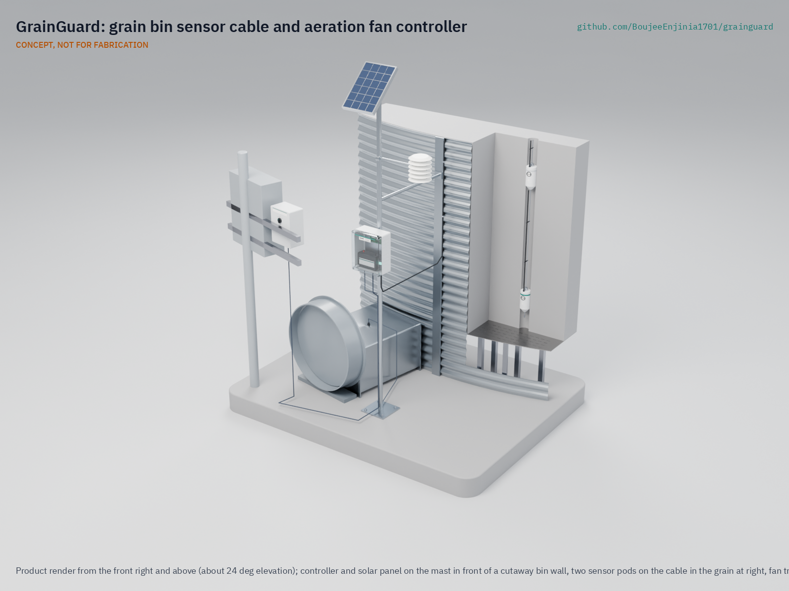

# GrainGuard

  

**Area:** Agriculture · **TRL:** 3 of 9 (proof of concept on paper) · **Prototype budget:** $260 USD per bin (kit $256.50) · **Difficulty:** 2 of 5

Cable of moisture and temperature probes strung through the bin, plus a controller that runs aeration fans only when the air will cool or dry the grain without rewetting it.

[Exploded render](media/render-exploded.png) · [Detail render](media/render-detail.png) · [Interactive 3D model](media/viewer.html) · [Concept blueprint (PDF)](media/concept-blueprint.pdf) · [General arrangement GGD-DWG-001 (PDF)](cad/drawings/GGD-DWG-001.pdf) · [Sizing calculations](docs/04-calcs/01-sizing.md) · [Review note](docs/REVIEW.md)

## Concept rationale

Most spoilage in an aerated bin starts with a fan run at the wrong time or a warm spot nobody saw, and both problems come down to measurement. A farmer standing beside a bin cannot tell whether a given hour's air will dry the grain or wet it, and cannot see a hot spot forming 3 m inside the grain. GrainGuard puts cheap, well-characterized temperature and humidity sensors where the answers are (in the grain, in the outside air and in the fan's discharge) and lets a small controller apply the rule that extension services already publish. It retrofits an existing bin and fan rather than replacing them, keeps mains voltage out of its own box, and needs no one to enter a bin that holds grain.

It is open and garage-buildable because the farms that most need it are the ones commercial systems price out. The parts are off-the-shelf sensors, a LoRa board, a small solar kit and a relay kit that any farm electrician can wire, so a farmer, an extension program or a cooperative can build, repair and adapt it, change the crop constants for local grain, and audit exactly how the fan decision is made.

## Burning platform

The FAO estimates that [13.3 % of the world's food was lost after harvest in 2023](https://www.fao.org/sustainable-development-goals-data-portal/data/indicators/1231-global-food-losses/en/), before it reached retail, on farms and in transport, storage, wholesale and processing. Poor storage costs more than grain: in 2004, maize stored damp in eastern and central Kenya became contaminated with aflatoxin, and [by July 20 that year 317 cases of acute aflatoxicosis and 125 deaths had been reported](https://www.cdc.gov/mmwr/preview/mmwrhtml/mm5334a4.htm) (CDC, MMWR).

Spoiled grain also kills the people who try to fix it. Grain that has crusted in storage and will not flow is one reason people enter bins, and in the United States [grain entrapments made up 34 of the 51 agricultural confined-space cases documented in 2024, with 41.2 % of entrapments fatal](https://www.purdue.edu/engineering/abe/agconfinespaces/wp-content/uploads/2025/05/2024-Summary-of-U.S.-Agricultural-Confined-Space-related-Injuries-and-Fatalities-Report.pdf) (Purdue University). Keeping grain in condition, and knowing its state without climbing the bin, removes both the loss and the reason to go in.

## Where it could be used

### By industry

| Industry | Use |
| --- | --- |
| Row-crop farming | Aeration control and grain monitoring for on-farm corn, soybean and wheat bins |
| Grain cooperatives and country elevators | Low-cost monitoring of small satellite bins that do not justify a commercial cable system |
| Seed production | Holding seed lots cool and dry to protect germination |
| Livestock and feed milling | Condition monitoring of on-site feed grain bins |
| Agricultural extension and education | A transparent teaching kit for aeration management and grain drying courses |

### By country or region

| Country or region | Why it matters there |
| --- | --- |
| United States | On-farm bins are common across the Corn Belt, and [grain entrapment is the leading cause of agricultural confined-space incidents](https://www.purdue.edu/engineering/abe/agconfinespaces/wp-content/uploads/2025/05/2024-Summary-of-U.S.-Agricultural-Confined-Space-related-Injuries-and-Fatalities-Report.pdf) |
| Australia | GRDC reports that [about two-thirds of Australian growers do not use aeration cooling](https://groundcover.grdc.com.au/farm-business/grain-storage/aeration-cooling-can-help-save-moist-grain), though it can be retrofitted to existing silos, and recommends an automatic controller |
| Brazil | Grain production outgrew storage by almost 90 Mt in 2021/22, and [only 15 % of farms have warehouses or silos](https://farmdocdaily.illinois.edu/2022/11/crop-production-in-brazil-outpaces-storage-capacity.html) (CONAB data), so new on-farm bins need affordable management |
| Kenya | Damp maize storage caused the [2004 aflatoxicosis outbreak](https://www.cdc.gov/mmwr/preview/mmwrhtml/mm5334a4.htm); cooperatives with small steel silos could use a low-cost condition monitor |
| India | A national study found [post-harvest losses of 3.89 % to 5.92 % for cereals](https://www.pib.gov.in/PressReleaseIframePage.aspx?PRID=1885038) (Ministry of Food Processing Industries, 2022), with storage one of the stages |

## What sparked the idea

The idea traces back to Mount Carroll, Illinois, in July 2010. Corn in a bin at Haasbach LLC was, in the words of an [NPR investigation](https://www.npr.org/transcripts/174828849), "wet and crusty, clogging the drain hole at the bottom and sticking to the walls", so workers were sent in to walk it down while the unloading equipment ran. Two teenagers, aged 14 and 19, were engulfed and killed, and OSHA later [cited the operator for willful violations](https://www.dol.gov/newsroom/releases/osha/osha20110124). The entry was a response to grain that had gone out of condition in storage. GrainGuard starts from the other end of that chain: measure the grain and the air, run the fan only when it helps, and see trouble early from the farmhouse, so that fewer bins ever reach the state that sends someone inside.

## Problem

Stored grain spoils when bins are aerated at the wrong times. Humid fall air can rewet grain, heating starts where no one can see it, and checking a bin by climbing it is dangerous. Commercial monitoring with fan control costs thousands of dollars per bin. Full problem statement: [docs/01-problem.md](docs/01-problem.md)

## Concept

One cable of six temperature and humidity pods hangs down the center of an existing bin. A solar-powered 12 V controller beside the bin compares the grain with the outside air, allows for the fan's own heat, and switches the existing fan through a small relay kit only when the air will cool or dry the grain rather than rewet it. It reports to a farmhouse receiver by LoRa radio. TRL 3 calculations for an 18 ft (5.49 m) bin of about 88.8 t of corn: a sensor-induced moisture error of 0.23 to 0.42 points, $256.50 in parts per bin with the farmhouse receiver costed per farm, and 7.7 days of winter battery autonomy with no sun. The kit includes a $9.50 plenum probe that measures the fan's own heat and stays within the $260 budget that Amish approved to cover the priced BOM ([GGD-DDR-002](docs/decisions/0002-recommendations-accepted.md)). The 10 W panel still refills the battery too slowly in winter; see [docs/04-calcs/01-sizing.md](docs/04-calcs/01-sizing.md).

Full design precis: [docs/02-concept.md](docs/02-concept.md)

## Key components

- Six Sensirion SHT45 and SHT40 pods on a 6 mm steel wire rope, RS-485 bus
- LoRa controller in an IP66 box on a mast
- Interposing relay kit with hand-off-auto switch, installed by an electrician in the fan starter
- Ambient temperature and humidity sensor in a radiation shield
- Plenum temperature probe in the fan transition, to measure the fan's own heat
- 10 W solar panel, charge controller and 12 V AGM battery
- Farmhouse LoRa receiver with display

The working bill of materials is in [bom/bom.csv](bom/bom.csv).

## Safety

> **Safety:** Never enter a bin that holds grain. Install the cable only in an empty bin, with unloading equipment locked out, a confined-space procedure and a trained spotter. The fan starts automatically: lock out at the disconnect before touching it. Only a licensed electrician connects the relay kit to the fan starter. Hang the cable only from a roof hanger the bin maker rates for cable loads. See the safety section of [docs/02-concept.md](docs/02-concept.md).

## Repository layout

| Folder | Contents |
| --- | --- |
| `docs/` | Problem, concept, requirements, calculations and design decisions |
| `cad/src/` | build123d Python source, the source of truth for all geometry |
| `cad/step/`, `cad/stl/` | Exported models for FreeCAD, other CAD tools and printing |
| `cad/drawings/` | 2D sketches and dimensioned drawings |
| `bom/` | Bill of materials |
| `electronics/` | KiCad schematics and PCB layouts |
| `firmware/` | Microcontroller code |
| `media/` | Renders, perspectives and photos |
| `build-log/` | Dated prototyping notes |

## Documentation

Controlled documents follow the portfolio [documentation standard](.kit/STANDARDS.md). Each carries a document ID (GGD-PRC-001 for the precis), a version and a revision history. Branded PDFs are built with `python .kit/render.py` and attached to GitHub Releases when a document is tagged, for example `GGD-PRC-001/v1.0`.

## Credits

Designed by Amish Chadha. See [CONTRIBUTORS.md](CONTRIBUTORS.md) for roles. To cite this design, use [CITATION.cff](CITATION.cff) (GitHub shows it as "Cite this repository").

AI assistance (Claude) was used to accelerate concept renders, prototype documentation and first-pass sizing calculations. Design direction and all decisions are Amish Chadha's, recorded in this repository's decision records (`docs/decisions/`).

## Licenses

- **Hardware** (CAD, drawings, BOM, electronics): [CERN-OHL-S v2](LICENSE)
- **Software** (firmware, scripts, notebooks): [MIT](LICENSE-SOFTWARE)

A project of the [Design Molecule](https://designmolecule.com) lab.
