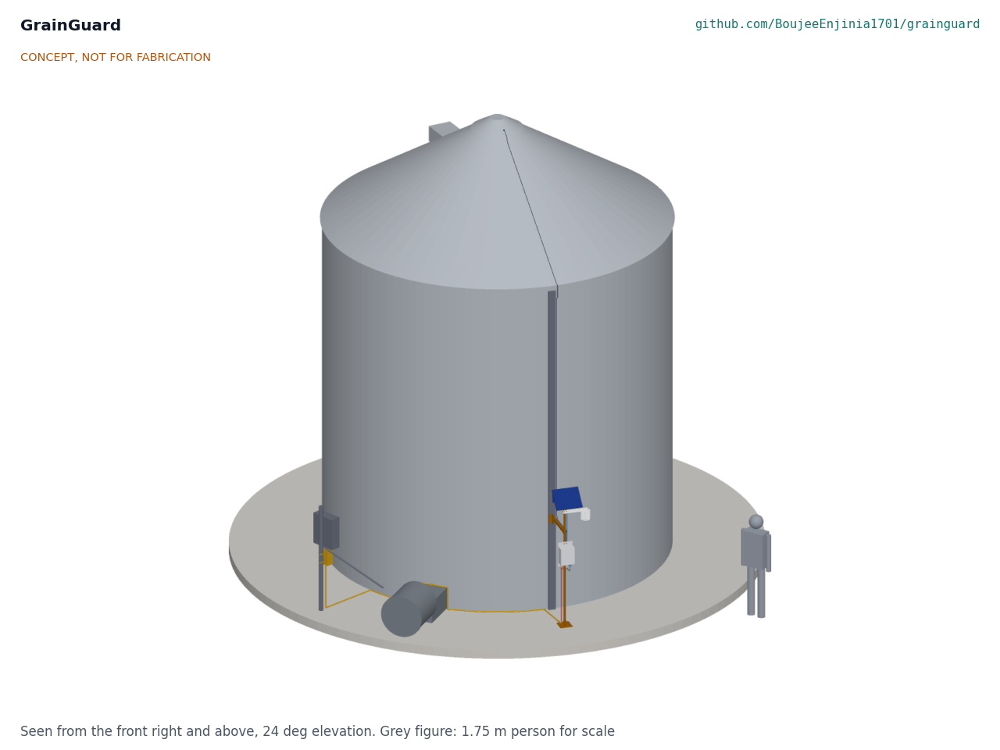
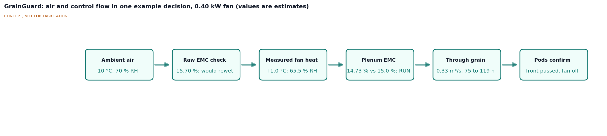
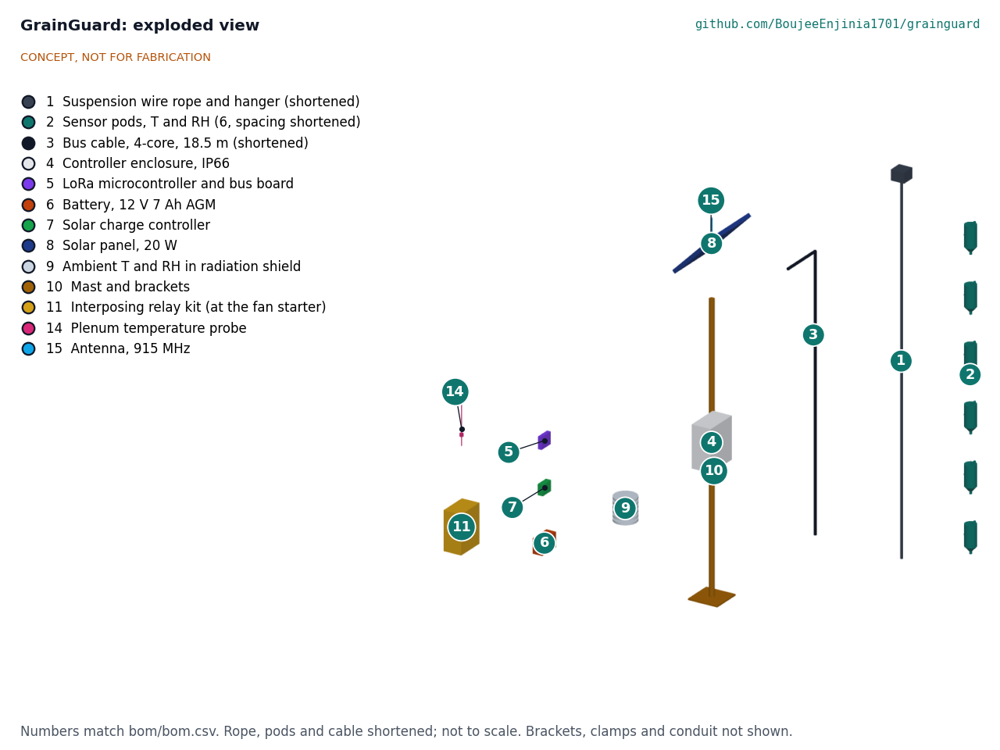
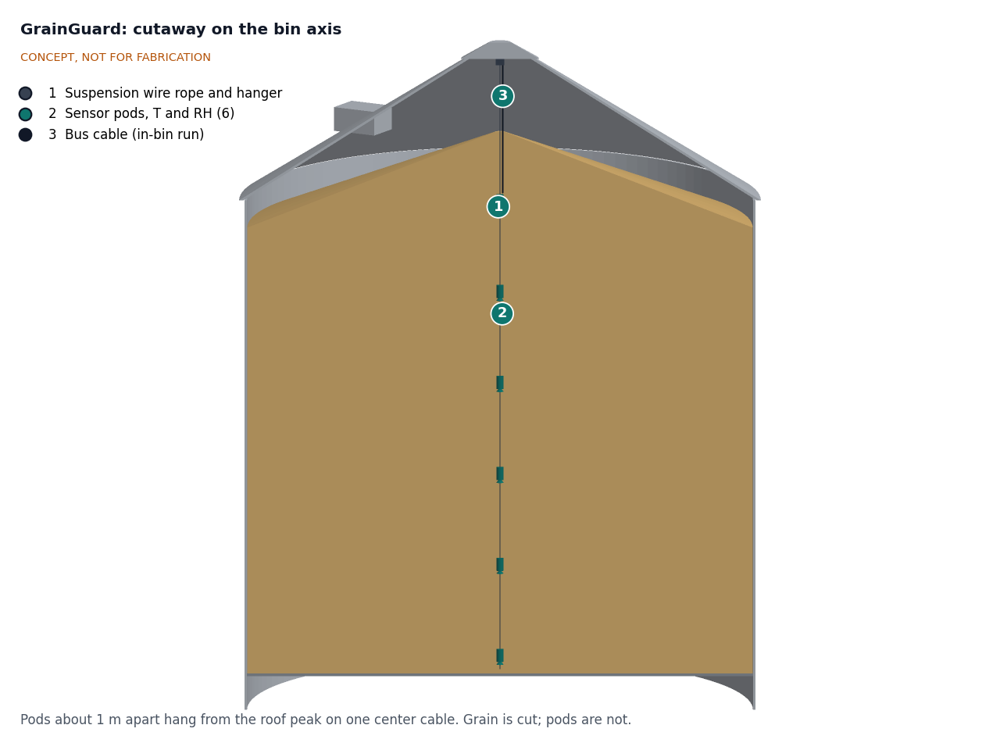

# GrainGuard design precis

GrainGuard hangs one cable of six temperature and humidity pods down the center of an existing grain bin, measures the outside air beside the bin, and switches the existing aeration fan through a small relay kit only when the air entering the grain will cool it or dry it. A solar-powered 12 V controller on a mast by the bin makes the decision and reports to a receiver in the farmhouse by LoRa radio. The TRL 3 calculations (GGD-CAL-001) for an 18 ft (5.49 m) bin of about 88.8 t of corn give a sensor-induced moisture error of 0.23 to 0.42 points and 7.7 days of battery autonomy with no sun. Value-engineering target: USD 260. Estimated cost of the constructable design (GGD-DDR-003 and the 2026-10-02 decisions): USD 406.50 per bin (USD 146.50 over the target). The kit includes a USD 9.50 plenum probe, which measures the fan's own heat (worth about one point of moisture per degree; GGD-DDR-002). The 20 W panel decided on 2026-10-02 refills the battery from half charge in 2.9 winter days, so power (R8) is met on paper; it also puts more load on the mast, so the stay is taken off only in calm weather.

*Figure 1. GrainGuard fitted to a 5.49 m (18 ft) bin, with a 1.75 m person for scale. The bin, fan and starter are existing farm equipment (grey); GrainGuard parts are colored.*

## How it works

1. **Sense the grain.** A 6 mm galvanized wire rope hangs from the bin's center roof hanger. Six sealed pods clamped to it, 0.94 m apart, each carry a Sensirion temperature and humidity sensor behind a vapor-permeable membrane: an SHT45 ([Sensirion](https://sensirion.com/products/catalog/SHT45)) in the bottom and top pods, where spoilage usually starts, and an SHT40 ([Sensirion](https://sensirion.com/products/catalog/SHT40)) in the four middle pods. Once the fan has been off for some hours, the air between the kernels comes to equilibrium with the grain, so each pod's temperature and relative humidity give the local grain temperature and, through the EMC equation, an estimate of grain moisture ([USDA ARS](https://www.ars.usda.gov/ARSUserFiles/30200525/362AccuracyGrainMoistureContentPrediction.pdf)). While the fan runs, the pods track the cooling front as it passes.
2. **Sense the air.** An SHT45 in a louvered radiation shield on the mast measures outside air. Heating does not change the air's humidity ratio, so the controller finds the plenum RH from the ambient humidity ratio and the plenum temperature, which is ambient plus the fan heat. The plenum probe (item 14), a temperature probe in the fan transition, measures the plenum temperature, so the fan heat (about 1.0 °C for a 0.40 kW fan, 0.5 to 2.7 °C across common fans, GGD-CAL-001 section A) is measured rather than assumed. The controller records the rise during each run and uses the last measured rise to decide whether to start the fan.
3. **Decide.** Every 10 min, on 30 min averages, the controller applies the rule below and asks for the fan on or off.
4. **Switch.** A 12 V signal line runs to an interposing relay kit in or beside the existing fan starter. Its optically isolated input draws 3 mA or less, and its relay, powered by its own 24 V supply, closes the starter's control circuit. A hand-off-auto switch keeps manual control, and a current transformer on one fan lead confirms that the fan runs.
5. **Report.** The controller sends readings, fan state and fan hours by LoRa, in packets of 24 bytes or less, to a small receiver in the farmhouse, which shows the bin status, logs data locally and raises heating and fault alarms.

*Figure 2. Air and control flow for one example decision. Values are estimates from GGD-CAL-001 for the reference case with a 0.40 kW fan.*

### Control rule

The control rule was decided by Amish on 2026-09-25 (GGD-DDR-001, D3). The farmer sets the crop, the target moisture (for example 15.0 % wet basis for corn held to spring) and a mode.

- **Cool mode** (after harvest and in fall): run when the plenum air is at least 5 °C (about 10 °F) cooler than the mean grain temperature and its EMC is no more than 1.0 point above target. This follows the extension rule of running when outside air is well below grain temperature ([University of Minnesota Extension](https://extension.umn.edu/corn-harvest/managing-stored-grain-aeration); [Oklahoma State University](https://extension.okstate.edu/fact-sheets/aeration-management-knowing-when-to-run-aeration-fans.html)), with a limit on rewetting. At the full allowance, one cooling cycle can add at most about 74 kg of water, enough to raise the bottom 0.37 m of grain by one point (GGD-CAL-001, section B).
- **Hold mode** (winter and spring): run only when the plenum-air EMC is at or below target and the air is within a set band of the grain temperature, so the fan never rewets or rewarms grain.
- **Stop when done.** The controller counts fan hours and watches the pods. When every pod has reached the new air temperature, the front has passed and the fan stops.
- **Protect the motor.** Minimum run 30 min, minimum off 15 min, no more than 4 starts per hour.
- **Fail off.** If the controller loses power or its sensor data are more than 30 min old, the relay drops out and the fan stops. The hand position of the switch always runs the fan.

The example in Figure 2 shows why the fan heat matters: outside air at 10 °C and 70 % RH has an EMC of 15.70 % and would rewet 15 % corn, but warmed 1.0 °C by a 0.40 kW fan it drops to 65.5 % RH and an EMC of 14.73 %, so the controller runs the fan. With a 1.1 kW fan the same air would reach the grain at 13.36 %.

## Main components

Numbers match the exploded view (Figure 3), drawing GGD-DWG-001 and `bom/bom.csv`.

| # | Component | Choice | Notes |
| --- | --- | --- | --- |
| 1 | Suspension wire rope and hanger | 6 mm galvanized 7x19 rope, 6.6 m hung, thimble, clips, shackle | Hangs from the bin maker's rated center hanger only |
| 2 | Sensor pods (6) | 2a: SHT45 (bottom and top, two); 2b: SHT40 (middle four); PTFE membrane, bus microcontroller, RS-485, potted pod 76 mm by 140 mm | 0.94 m apart; bottom pod 0.25 m above the floor, top pod 0.25 m below a level surface |
| 3 | Bus cable | 4-core shielded UV-rated cable, 18.5 m, 12 V and RS-485 | A main run and five pod jumpers; up the rope, out through a gland in the peak cap, over the roof, down the wall, along the stay; 16.8 m from the model |
| 4 | Controller enclosure | IP66 polycarbonate, about 280 x 230 x 130 mm | On the mast, shaded side of the bin |
| 5 | LoRa microcontroller and bus board | nRF52840 plus SX1262 class module, RS-485 transceiver, buck regulator | 915 MHz in the Americas |
| 6 | Battery | 12 V 7 Ah AGM lead-acid | Accepts charge below 0 °C; capacity open (GGD-DDR-001, O2) |
| 7 | Solar charge controller | 12 V PWM, temperature compensation clamped at 15.0 V, adjustable low-voltage disconnect set to the battery maker's 50 % figure at -20 °C (about 12.1 V), 6 mA or less self-use | Clamp keeps the system at 15 V or less (R12) |
| 8 | Solar panel | 20 W, about 430 x 350 mm (decided on 2026-10-02, GGD-DEC-001, item 2); with the stay off the mast alone holds it only in gusts under about 30 m/s (GGD-CAL-001 F6); tilted 45 degrees, facing away from the bin | On top of the mast, out of the wall's shade (decided by Amish on 2026-09-27, GGD-DDR-002) |
| 9 | Ambient sensor | SHT45 in a louvered radiation shield on a 330 mm arm | 1.8 m above the pad, away from the bin wall's reflected heat |
| 10 | Mast and brackets | DN25 (33.7 x 3.2 mm) galvanized pipe, 2.3 m, welded to a base plate anchored to the pad; one angle stay bolted to a bracket on a wall stiffener; six mast clamps | No drilling of bin sheets (GGD-DDR-003) |
| 11 | Interposing relay kit | DIN 24 V supply, relay with optically isolated 12 V input of 3 mA or less, hand-off-auto switch, current transformer | Only mains-connected item; licensed electrician installs |
| 12 | Farmhouse receiver | ESP32 plus LoRa with display and Wi-Fi | One per farm, costed per farm; not shown in the model |
| 13 | Hardware and consumables | Ties, anchors, sealant, conformal coating | Not shown |
| 14 | Plenum temperature probe | DS18B20 probe (±0.5 °C) in the fan transition, downstream of the fan | In the base kit (GGD-DDR-002); measures the fan heat for R4 |

*Figure 3. Exploded view with numbered callouts matching the BOM. The rope, pods and cable are shortened and the view is not to scale.*

*Figure 4. Cutaway on the bin axis showing the sensor cable hanging from the roof peak through 5.2 m of grain.*

## Key numbers

All numbers below come from GGD-CAL-001, which also gives the status of every requirement. Tags in brackets refer to lines of `docs/04-calcs/sizing.py`.

*Table 1. Key numbers for the reference case.*

| Quantity | TRL 3 value | Requirement |
| --- | --- | --- |
| Grain held, level to the eave | 123.1 m³, 3,493 bu, 88.8 t of corn [A2] | |
| Airflow at 0.2 cfm/bu; static pressure | 0.330 m³/s (699 cfm); 139 Pa (0.56 in wc) [A3], [A4] | |
| Fan heat rise | 1.0 °C at 0.40 kW; 0.5 to 2.7 °C for 0.2 to 1.1 kW [A7] | Measured by item 14 |
| Cooling front time | 75 to 119 h of fan time [A8] | |
| Plenum EMC change per °C of fan heat | 0.97 points [B1] | |
| Plenum EMC uncertainty with the probe | about ±0.50 points (±0.51 °C on the fan heat) [B10] | R4 met |
| Sensor-induced EMC error, worst case 20 % to 75 % RH | 0.23 points (SHT45), 0.42 points (SHT40) [B5] | R2 at risk |
| Hot spot coverage, one center cable | 3.3 % of the cross-section [C2] | R6 at risk |
| Daily energy, fan continuous | 3.28 Wh [D3] | |
| Autonomy with no sun at -20 °C, fan continuous | 7.7 days [D5] | R8 autonomy met |
| Refill from 50 % at 1.5 winter peak sun hours | 2.9 days with the 20 W panel decided on 2026-10-02 (7.3 days with 10 W) [D6]; a panel of about 19 W meets 3 days | R8 recovery met |
| Radio margin at 1 km past one building | 16.9 dB [E3] | R7 met |
| Cable pull-down estimate; rope factor on 2.5 kN | 2.08 kN; 8.0 [F2], [F3] | R10 rope met; hanger per bin |
| Per-bin kit, constructable design; receiver per farm | USD 406.50; USD 22.00 [H1], [H2] | R13: USD 146.50 over the USD 260 value-engineering target |

The fan heat was the largest uncertainty at TRL 3: an error of 1 °C in an assumed value shifts the decision by about one point of EMC, more than the whole sensor error. The plenum probe measures it for $9.50 and cuts that error to about ±0.5 points.

## Key design choices

Every choice below was decided by Amish on 2026-09-25 by adopting the TRL 2 recommendations (GGD-DDR-001) and the TRL 3 recommendations (GGD-DDR-002).

- **RH-based moisture sensing rather than capacitance probes** (D4). Interstitial RH with an EMC equation is cheap and has published accuracy data; its weakness is wet grain above about 80 % RH and the need for crop-specific constants.
- **One center cable with six pods** (D5), enough for a 5.5 m bin at this price; larger bins need more cables.
- **RS-485 pod bus with a small microcontroller in each pod** (D6). The SHT4x sensors have a fixed I²C address and I²C does not suit 15 m of cable.
- **Solar 12 V controller with an electrician-installed relay kit** (D7). Keeps mains out of the GrainGuard box.
- **AGM battery rather than lithium iron phosphate** (D8). AGM accepts charge below freezing; LiFePO₄ cells generally must not be charged below 0 °C without a heater.
- **Plenum sensing** (GGD-DDR-001 D9; GGD-DDR-002). The lowest-cost form, a temperature-only probe, did not fit in the former $250 budget, but Amish adopted it into the base kit, since no other USD 9.50 buys as much decision accuracy.
- **Control rule, modes and default targets** as set out above (D3).
- **Headspace CO₂ sensor as an option**, not in the base kit (D10).
- **Cost** (D1): per bin with the farmhouse receiver costed per farm, reported against a value-engineering target of USD 260 (Amish, 2026-10-01). The concept kit was USD 256.50; the constructable design (GGD-DDR-003) with the 2026-10-02 decisions is USD 406.50, USD 146.50 over the target.
- **Relay input of 3 mA or less and charging clamped at 15.0 V**, set in GGD-CAL-001 to meet R8 autonomy and R12 at no cost (GGD-DDR-002).

## Safety

> **Safety:** Grain bins kill people. GrainGuard is designed so that no one needs to enter a bin holding grain, but installing the cable still means roof work and entry into an empty bin, and the controller starts a fan and a motor automatically. Treat each of these as a hazard at every stage.

- **Engulfment and entrapment.** Never enter a bin holding grain to install or service GrainGuard. Install the cable only with the bin empty, unloading equipment locked out, a confined-space entry procedure, and a trained spotter outside. Flowing grain can bury a person in seconds.
- **Falls.** The cable is fed through the roof manhole or peak cap. Use the bin's ladder cage and roof rail with fall protection; do not work on a wet, icy or windy roof.
- **Automatic fan start.** The fan can start at any time in automatic mode. Mark the fan and starter "Starts automatically", lock out at the disconnect before touching the fan, transition or plenum, and never rely on GrainGuard being "off" for safety. Keep guards on the fan inlet.
- **Mains voltage.** The fan starter carries 230 V single-phase or 208 V to 480 V three-phase. Only a licensed electrician installs the relay kit (item 11), with isolation of at least 2.5 kV between the 12 V input and the relay contacts. GrainGuard's own box, cable and pods are 12 V DC.
- **Roof load.** Grain drags on the cable during unloading. Hang the rope only from a hanger the bin maker rates for cable loads; an unrated roof can buckle. Unload from the center first, as the bin maker requires.
- **Lightning and surges.** A tall steel bin attracts lightning, and the cable enters from the roof. Bond the rope and cable shield to the bin, add surge protection on the bus at the controller, and keep the signal cable to the starter short.
- **Fumigants.** Phosphine is highly toxic and corrodes copper and electronics ([FAO fumigation manual](https://www.fao.org/4/x5042e/x5042e0a.htm)). Only certified applicators fumigate. GrainGuard does not measure phosphine and must not be used to decide when a bin is safe to enter. The pod boards are conformally coated for the prototype; a coated test board is left in the bin through one fumigation at TRL 4, and sealed connectors follow if it shows copper corrosion (GGD-DEC-001, item 5).
- **Grain dust.** Dust in the headspace can burn or explode. The pods run at 12 V and a few milliamps, but the design has not been assessed against hazardous-location rules; keep all connections outside the bin sealed and never open pods inside a dusty bin.
- **Plenum probe.** Fitting the probe means drilling one 12 mm hole for a gland in the fan transition. Lock out the fan at the disconnect first, keep hands out of the transition, and fit the probe downstream of the fan, never near the impeller.
- **Battery.** The 12 V AGM battery can deliver high short-circuit current and vents hydrogen if overcharged. Fuse it at the terminal and use a temperature-compensated charger with its voltage clamped at 15.0 V. A lead-acid battery left partly discharged can freeze and crack at about -25 °C, so the controller's adjustable low-voltage disconnect is set to the battery maker's 50 % figure at -20 °C, about 12.1 V (GGD-DEC-001, item 6; confirmed at TRL 4).

## Open questions

The open decisions and the items to confirm when parts are bought are kept in the design decisions register, [GGD-DEC-001](06-design-decisions.md); the build plan is [GGD-BLD-001](05-build-plan.md).

- Battery and panel capacity for the recovery half of R8: decided by Amish, 2026-10-02 (GGD-DEC-001, item 2): a 20 W panel, provided the mast check with the stay off is rerun for it and still passes. The rerun does not pass at a 45 m/s gust (0.9 times yield); a 30 m/s service limit for the stay-off case is proposed, awaiting Amish (GGD-CAL-001 F6).
- First host farm and electrician: decided by Amish, 2026-10-02 (GGD-DEC-001, item 4): recruit them through a land-grant extension grain-storage specialist, for example at Purdue University or Iowa State University.
- Pitch wording against the cool-mode rewet bound: decided by Amish, 2026-10-02 (GGD-DEC-001, item 3): the pitch says only "cool it or dry it", and the cool-mode allowance is kept.
- Confirm the control rule's defaults and target moisture values with the extension specialist and the host farmer before automatic mode is first used (GGD-DEC-001, item 8, decided 2026-10-02).
- How long interstitial air takes to reach equilibrium after the fan stops, so the controller knows when a moisture reading is valid.
- Phosphine protection: decided 2026-10-02 (GGD-DEC-001, item 5): conformal coating, proven on a test board through one fumigation at TRL 4.
- Low-voltage disconnect setting: decided 2026-10-02 (GGD-DEC-001, item 6): the battery maker's 50 % figure at -20 °C, about 12.1 V, confirmed at TRL 4.
- Which bin makers rate their roof hangers for cable loads.
- LoRa coverage on a real farm with the bin in the path.

Concept media: [blueprint sheet](../media/concept-blueprint.pdf), [interactive 3D model](../media/viewer.html). General arrangement: [GGD-DWG-001](../cad/drawings/GGD-DWG-001.pdf).
